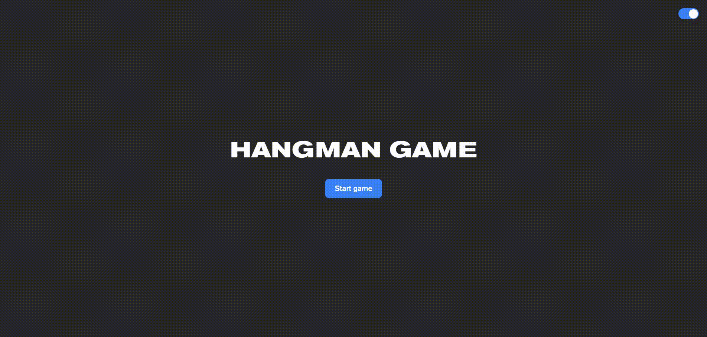

# hangman-game
### Ссылка на прототип:

https://vobiryukov12-hangman-game.netlify.app/

## Preview

## Описание
Hangman - это интерактивная версия классической игры, где игроку нужно угадать слово, имея только ограниченное количество попыток. Каждое слово в игре генерируется с использованием API ChatGPT.

##### Технологии используемые на проекте:

##### В проекте реализовано:

- Стартовый экран:
  - Название игры
  - Кнопка "Start game"

- Экран с игрой:
  - Поле, где появляется по частям картинка с виселицей 
  - Прочерки для каждой буквы слова 
  - Клавиатура 
  - Кнопка "Quit" для досрочного завершения игры 

- Экран проигрыша:
  - Картинка с виселицей (красная)
  - Надпись "You lost"
  - Загаданное слово    
  - Кнопка "Play again"

- Экран выигрыша
  - Картинка с виселицей (зелёная)
  - Надпись "You won"
  - Загаданное слово    
  - Кнопка "Play again"

- Экран досрочного завершения игры
  - Загаданное слово    
  - Кнопка "Play again"

##### Особенности проекта:

- Если в течение 3 секунд слово не будет сгенерировано, то будет использовано случайное слово из предварительно определенного массива.
- Из соображений безопасности, чтобы предотвратить доступ к API-ключу через инструменты разработчика в браузере, клиентская часть не взаимодействует напрямую с API. Для этого реализована бессерверная функция на Netlify, которая используются для развертывания кода на стороне сервера без необходимости использования выделенного сервера. Эта функция отправляет запрос к API и получает ответ.
